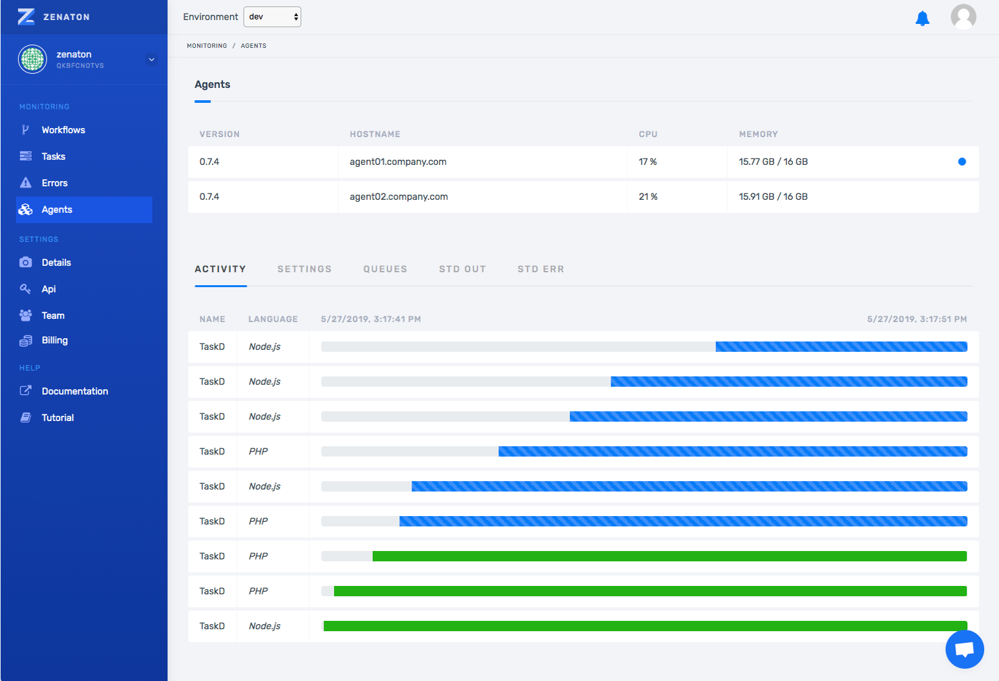
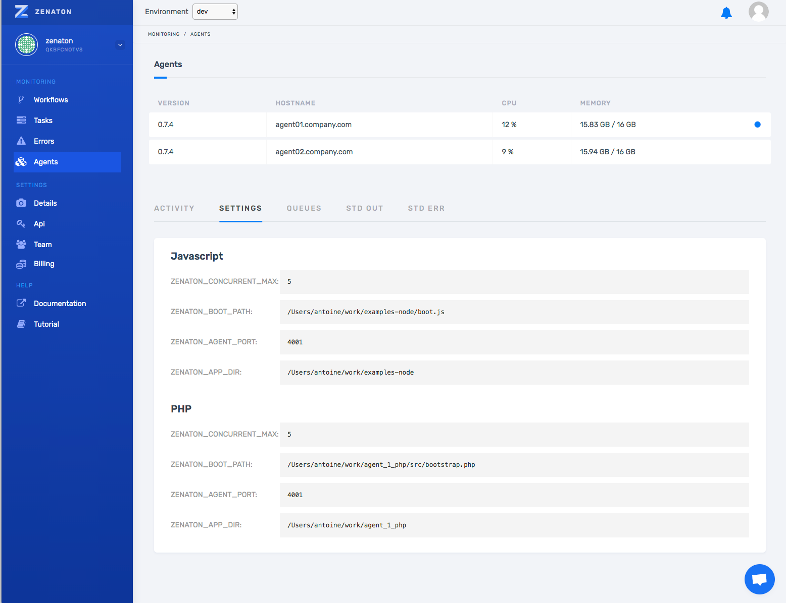
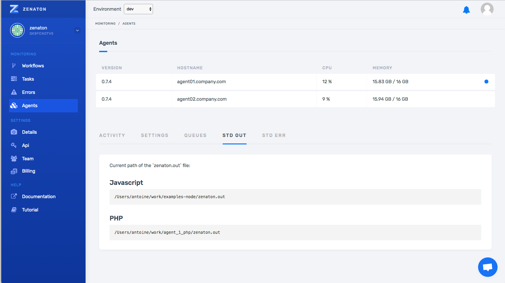

One of the biggest benefits of using Zenaton to run background jobs is the visibility that developers have into all of their processes on the dashboard. To take it to the next level, we are offering new level of visibility into your agents.

Now you can see a real time overview of your connected agents — to verify that the are installed and running as they should. If there is a problem, you can quickly troubleshoot and fix it.
So check it out. For a given environment (“dev” in our example below) the ‘Agents’ section on the dashboard displays the following information:

* A list of all installed agents with CPU and RAM usage
* Real-time activity per agent (tasks running)
* Tasks and workflows that are assigned to that agent
* Agent Settings that are configured at deployment.

Once you select an agent, you have access to more information that is split into several tabs.

## Activity tab

Watch a real-time progression of tasks being executed on the agent for single tasks and tasks within workflows.

## Settings tab

View the agent parameters that are currently in use by your agent which you set during deployment (mostly what you have set in the .env file).

* Shows which types of tasks agent is configured to execute
* Allows you to confirm that all settings are configured as expected

It’s useful to check if the currently used parameters match your expectations, after a new agent configuration deployment for example.

Note: normally tasks are distributed evenly over all agents but the agent can be configured to run specific types of tasks to optimize performance.

## Queues tab

Zenaton dynamically deploys a queue for each new type of task or workflow encountered. Agents are dynamically configured to listen those queues — according to their own configuration.

So, the queue tab shows a list of all tasks or workflows that have been assigned to that agent and have run or started to run. This allows you to see the capability of the agent — what tasks or workflows are allowed to run.

It might be useful to check the advanced setup if you want the agent to “specialize” and use the handle_onlyand handle_exceptparameters.

For example, if you have a workflow for resizing images, and you want it to be run only by the second agent that has more CPU capacity.

### SDT OUT & STD ERR

While an agent is running tasks, the output is written to two files: `zenaton.out` for std-out and `zenaton.err` for std-err.

Those tabs respectively give you the paths of the zenaton.out and zenaton.err files on your agent.

Agent monitoring is another step on the Zenaton roadmap towards full visibility into your background processes. We see it as another tool in the developer toolset to verify everything is running as it should or…if there is a problem…to quickly identify the origin and fix it.

Please share your feedback and requests below 👇🏻! And keep shipping!
