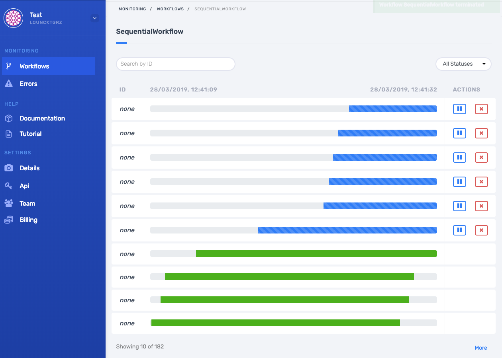
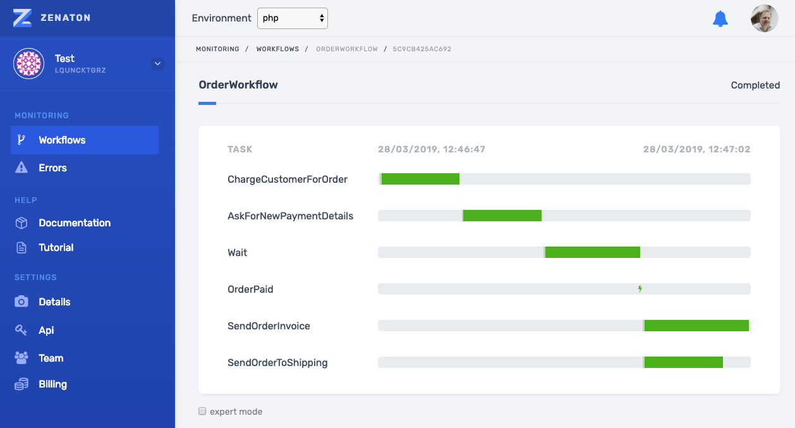
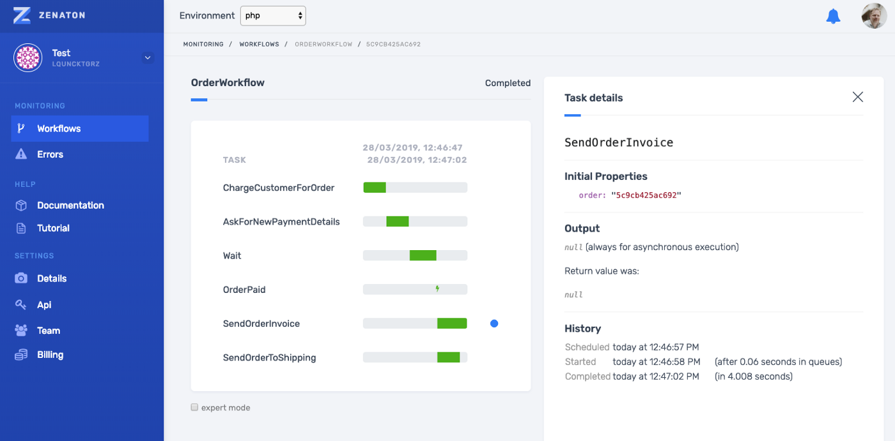

From the early days of Zenaton, we have provided an easy way to orchestrate asynchronous jobs to build business processes. We have now made it easy for developers to monitor all of their jobs so that they know that everything is running smoothly and have the tools to quickly troubleshoot and fix errors.

We have just released Workflow Monitoring - a big feature that can be accessed through the Zenaton’s dashboard. It provides real time visuals for all workflows and tasks and can be accessed by anyone on the team. The dashboard includes a high level view of all the tasks and shows the sequence of events within a workflow. It also provides details on each task and errors so that problems can be quickly identified and fixed.

The dashboard provides a clear and real-time view of the number of workflows running, as well as how many were killed or completed.

For a specific workflow type, you can see — still in real-time — a representation of the last instances’ execution duration.

At last, the detail of an instance execution is shown like a Gantt :

Note that, when a job failed, you can see the error and stack trace from here. You can even manually retry the job.

And to give you a sneak preview of what is coming next, here are a few features we are working on right now: 

* view on which worker the job was processed
* visualise the changes of a workflow’s properties
* skip some jobs
* more details on decisions
* more statistics
  …

This feature is an important step forward to our mission to provide the best tooling possible to developers to manage asynchronous jobs and workflows. I will be happy to have your comments and requests below 👇🏻!
